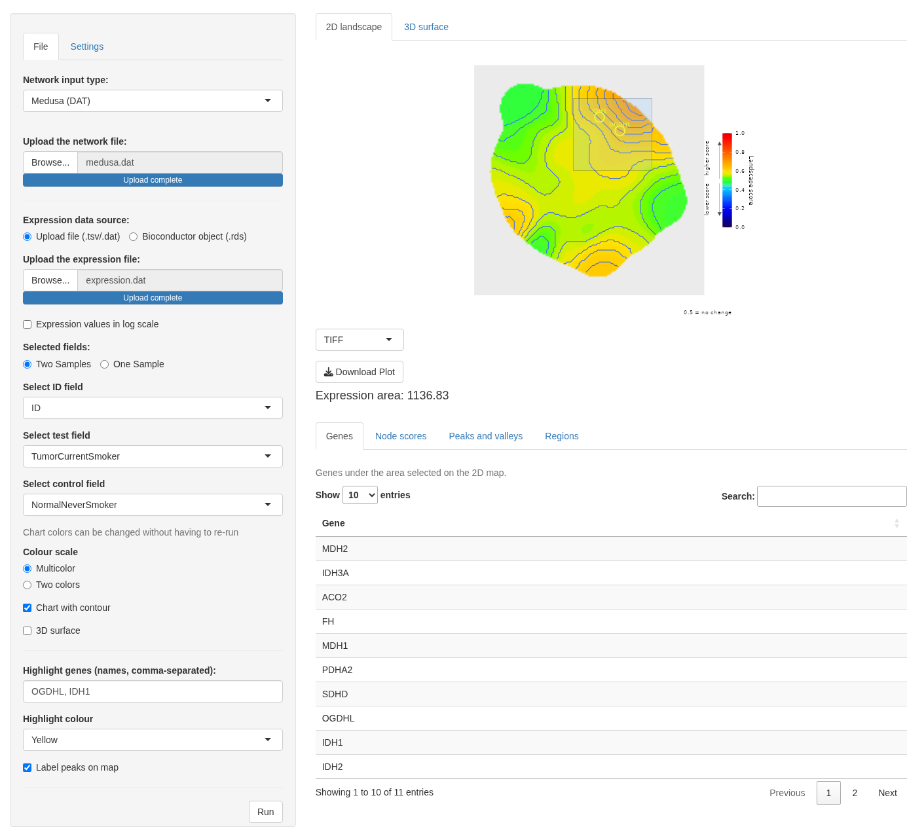

# Overview

The **levi (Landscape Expression Visualization Interface)** is a package for
the R environment that integrates gene expression data with biological networks,
generating a topographic landscape where elevated regions correspond to
differentially expressed genes and their network neighbors.

**levi** is based on two prior tools: Viacomplex (@Castro2009), written in
Fortran using the Dislin library, and Galant (@Camilo2013), a Cytoscape plugin.

Two files are required to use **levi**: a gene expression file and a biological
network file. Alternatively, results from differential expression tools
(DESeq2, edgeR, limma) or single-cell tools (Seurat) can be passed directly
as R objects.

**Web interface (no installation required):** An interactive demo is available
via Binder at:
`https://mybinder.org/v2/gh/jrybarczyk/levi/master?urlpath=shiny/inst/shiny/`

# Input Files

## Gene Expression Data

The expression file must contain a column with gene identifiers (Gene Symbol,
Entrez ID, Ensembl, etc.) and at least one column with expression values
(e.g., normalized counts, log2 fold-change).

If some network genes have no expression value, **levi** assigns a neutral
value (0.5), representing no change, and generates a log file listing
the missing genes.

Expression data can be obtained from:

* [Gene Expression Omnibus (GEO)](https://www.ncbi.nlm.nih.gov/geo/)
* [Array Express](https://www.ebi.ac.uk/arrayexpress/)
* [The Cancer Genome Atlas (TCGA)](https://cancergenome.nih.gov/)
* [Sequence Read Archive (SRA)](https://www.ncbi.nlm.nih.gov/sra)

## Biological Network

**levi** supports the following network file formats:

|Extension|Format|
|:-------:|:----:|
|`dat`|Medusa (DAT)|
|`dyn`|RedeR (DYN)|
|`net`|Pajek (NET)|
|`stg`|STRING / STITCH|

Network interaction data can be obtained from:

* [STRING database](https://string-db.org/)
* [miRBase](https://mirbase.org/)

## Networks with no coordinates

Every format above carries a position for each node, because **levi** draws its
landscape over the plane the network occupies. Interaction databases and
collaborators usually hand over something simpler: a list of pairs, with no
coordinates at all.

`leviFromEdges()` computes them with **igraph** and returns the two tables
`levi()` expects:

```{r eval=TRUE, fig.height=5, fig.width=5}
library(levi)

interactions <- data.frame(
    from = c("HUB", "HUB", "HUB", "HUB", "N1", "N2", "N3", "N4"),
    to   = c("N1", "N2", "N3", "N4", "N5", "N6", "N7", "N8"),
    stringsAsFactors = FALSE)

set.seed(42)                       # force-directed layouts are stochastic
net <- leviFromEdges(interactions, layout = "kk")
head(net$nodes)

expression <- data.frame(
    ID      = c("HUB", paste0("N", 1:8)),
    Test    = c(200, 200, 200, 200, 200, 5, 5, 5, 5),
    Control = c(10, 10, 10, 10, 10, 200, 200, 200, 200))

res_edges <- levi(
    networkCoordinatesInput  = net$nodes,
    networkInteractionsInput = net$edges,
    fileTypeInput            = "stg",
    expressionInput          = expression,
    geneSymbolInput          = "ID",
    readExpColumn            = readExpColumn("Test-Control"),
    resolutionValueInput     = 30,
    smoothValueInput         = 50)

res_edges$scores[, c("Gene", "LandscapeScore", "Rank")]
```

A caveat worth keeping in mind: the layout is an analytical choice, not only an
aesthetic one. The same expression values arranged differently give a different
landscape, because **levi** reads neighbourhoods. Where a curated layout
already exists, prefer it over a computed one.

# Viewing Modes

## Graphical User Interface (GUI)

The GUI runs locally via Shiny and provides interactive controls for all
visualization parameters.

```{r eval=FALSE}
library(levi)
LEVIui(browser = TRUE)   # Opens in the system browser
LEVIui(browser = FALSE)  # Opens inside RStudio
```

<center></center>
<center><b>Figure 1:</b> Graphical User Interface.</center>

## Script Mode

### Basic usage

```{r eval=TRUE, fig.height=6, fig.width=6}
library(levi)

template_network <- file.path(system.file(package = "levi"), "extdata",
                              "medusa.dat", fsep = .Platform$file.sep)

template_expression <- file.path(system.file(package = "levi"), "extdata",
                                 "expression.dat", fsep = .Platform$file.sep)

multicolor <- levi(
    networkCoordinatesInput = template_network,
    expressionInput        = template_expression,
    fileTypeInput          = "dat",
    geneSymbolInput        = "ID",
    readExpColumn          = readExpColumn("TumorCurrentSmoker-NormalNeverSmoker"),
    contrastValueInput     = 50,
    resolutionValueInput   = 20,
    zoomValueInput         = 50,
    smoothValueInput       = 5,
    contourLevi            = TRUE
)
```

The example dataset contains lung cancer microarray data comparing tumor
tissue from current smokers against normal tissue from never-smokers.
Elevated regions (warm colors) represent network areas where genes are
more expressed in tumors, while depressed regions (cool colors) represent
down-regulated areas. The contour lines delineate boundaries between
expression zones, analogous to elevation contours on a topographic map.

### Comparing multiple conditions (batch mode)

The `readExpColumn()` function allows multiple comparisons to be processed
in a single call:

```{r eval=TRUE, fig.height=6, fig.width=6}
base <- readExpColumn(
    "TumorCurrentSmoker-NormalNeverSmoker",
    "TumorFormerSmoker-NormalFormerSmoker"
)

levi(
    networkCoordinatesInput = template_network,
    expressionInput         = template_expression,
    fileTypeInput           = "dat",
    geneSymbolInput         = "ID",
    readExpColumn           = base,
    setcolor                = "pink_green",
    contourLevi             = FALSE
)
```

### Signal transformation (`signal_mode`)

The `signal_mode` parameter controls how raw expression values are converted
to the landscape score in \[0, 1\]. Choose based on your data type:

| `signal_mode` | Formula | Score 0.5 means | Best for |
|:---:|:---|:---|:---|
| `"ratio"` (default) | `Test / (Test + Control)` | Test ≈ Control | Raw counts, TPM, FPKM, linear proteomics LFQ |
| `"logfc"` | `1 / (1 + e^{−k · logFC})` | logFC = 0 (no change) | RMA microarray, VST/rlog DESeq2, log2-proteomics, scRNA-seq avg\_log2FC |
| `"zscore"` | `pnorm(z)` where `z = (logFC − μ) / σ` | Mean logFC of support points | Relative position within a comparison |

**Quick guide by experiment type:**

| Data type | `signal_mode` | `expressionLog` | Input columns |
|:---|:---:|:---:|:---|
| Raw counts (RNA-seq) | `"ratio"` | `FALSE` | mean\_test, mean\_ctrl |
| TPM / FPKM | `"ratio"` | `FALSE` | mean\_test, mean\_ctrl |
| Microarray RMA (log2) | `"logfc"` | `FALSE` | log2\_test, log2\_ctrl |
| DESeq2 `log2FoldChange` only | `"logfc"` | `FALSE` | `readExpColumn("log2FoldChange-log2FoldChange")` |
| edgeR / limma `logFC` only | `"logfc"` | `FALSE` | `readExpColumn("logFC-logFC")` |
| scRNA-seq `avg_log2FC` | `"logfc"` + `logfc_k = 0.5` | `FALSE` | `readExpColumn("avg_log2FC-avg_log2FC")` |
| scRNA-seq `pct.1` / `pct.2` | `"ratio"` | `FALSE` | pct.1, pct.2 |
| Proteomics log2 LFQ | `"logfc"` | `FALSE` | log2\_LFQ\_test, log2\_LFQ\_ctrl |
| Multi-condition / heterogeneous | `"zscore"` | any | Test, Control |

The `logfc_k` parameter controls the steepness of the sigmoid in `"logfc"` mode:

- **`k = 0.3–0.5`** — large fold-change datasets (scRNA-seq often reaches ±5)
- **`k = 1`** (default) — typical RNA-seq or proteomics (±2)
- **`k = 2–3`** — tight microarray fold-changes (±0.5–1)

```{r eval=FALSE}
# Microarray RMA — keep log2 scale, use logfc mode
res_rma <- levi(
    networkCoordinatesInput = template_network,
    expressionInput         = rma_expression_df,   # columns: ID, Tumor_log2, Normal_log2
    fileTypeInput           = "dat",
    geneSymbolInput         = "ID",
    readExpColumn           = readExpColumn("Tumor_log2-Normal_log2"),
    signal_mode             = "logfc",
    expressionLog           = FALSE   # keep in log2 scale; no 2^ transform
)

# scRNA-seq — single-column avg_log2FC with reduced steepness
res_sc <- levi(
    networkCoordinatesInput = template_network,
    expressionInput         = seurat_markers_df,  # column: GeneID, avg_log2FC
    fileTypeInput           = "dat",
    geneSymbolInput         = "GeneID",
    readExpColumn           = readExpColumn("avg_log2FC-avg_log2FC"),
    signal_mode             = "logfc",
    logfc_k                 = 0.5     # softer gradient for large FC values
)

# DESeq2 log2FoldChange as single column
res_deseq <- levi(
    networkCoordinatesInput = template_network,
    expressionInput         = leviFromDESeq2(dds_result),
    fileTypeInput           = "dat",
    geneSymbolInput         = "GeneID",
    readExpColumn           = readExpColumn("log2FoldChange-log2FoldChange"),
    signal_mode             = "logfc"
)
```

The recipes above assume objects from your own analysis. The package ships a
small log2-scale dataset so the `"logfc"` recipe can be run as it stands:

```{r eval=TRUE, fig.height=5, fig.width=5}
logfc_net  <- system.file("extdata", "logfc_network.dat", package = "levi")
logfc_expr <- system.file("extdata", "logfc_expression.dat", package = "levi")

# Control is 8 for every gene and Test runs from 3 to 10, so the logFC
# spans -5 to +2 on the log2 scale.
res_logfc <- levi(
    networkCoordinatesInput = logfc_net,
    expressionInput         = logfc_expr,
    fileTypeInput           = "dat",
    geneSymbolInput         = "ID",
    readExpColumn           = readExpColumn("Test-Control"),
    resolutionValueInput    = 40,
    signal_mode             = "logfc",
    expressionLog           = FALSE   # already log2; no back-transform
)

res_logfc$scores[, c("Gene", "LandscapeScore", "Rank")]
```

Only `GF` sits above the neutral 0.5, which is the single gene whose test
value exceeds the control.

### Two-color palettes

The `setcolor` parameter selects the color palette. Available options are:

| Value | Description |
|:---:|:---|
|`"default"`| 20-level multicolor (blue → red)|
|`"purple_pink"`| Two-color: purple → pink|
|`"green_blue"`| Two-color: green → blue|
|`"blue_yellow"`| Two-color: blue → yellow|
|`"pink_green"`| Two-color: pink → green|
|`"orange_purple"`| Two-color: orange → purple|
|`"green_marine"`| Two-color: green → marine|

# 3D Interactive Visualization

When the `plotly` package is installed, **levi** can generate an interactive
3D surface plot in addition to the standard 2D landscape. The user can rotate,
zoom, and inspect expression values interactively.

```{r eval=FALSE}
install.packages("plotly")

levi(
    networkCoordinatesInput = template_network,
    expressionInput         = template_expression,
    fileTypeInput           = "dat",
    geneSymbolInput         = "ID",
    readExpColumn           = readExpColumn("TumorCurrentSmoker-NormalNeverSmoker"),
    plot3d                  = TRUE
)
```

The 3D surface uses the same color palette as the 2D plot. Peaks in the
landscape correspond to network sub-regions with high expression in the test
condition; valleys correspond to down-regulated regions.

# Importing from Differential Expression Tools

**levi** accepts results directly from standard differential expression
workflows, eliminating the need to manually prepare input files.

## From DESeq2

```{r eval=FALSE}
library(DESeq2)
library(levi)

# After running DESeq2 analysis:
res <- results(dds, contrast = c("condition", "Tumor", "Normal"))

expr_df <- leviFromDESeq2(res, gene_col = "GeneSymbol")

levi(
    expressionInput         = expr_df,
    networkCoordinatesInput = template_network,
    fileTypeInput           = "dat",
    geneSymbolInput         = "GeneSymbol",
    readExpColumn           = readExpColumn("log2FoldChange-log2FoldChange"),
    signal_mode             = "logfc"
)
```

## From edgeR

```{r eval=FALSE}
library(edgeR)
library(levi)

fit  <- glmQLFit(dge, design)
qlf  <- glmQLFTest(fit, coef = 2)

expr_df <- leviFromEdgeR(qlf, gene_col = "GeneSymbol")

levi(
    expressionInput         = expr_df,
    networkCoordinatesInput = template_network,
    fileTypeInput           = "dat",
    geneSymbolInput         = "GeneSymbol",
    readExpColumn           = readExpColumn("logFC-logFC"),
    signal_mode             = "logfc"
)
```

## From limma

```{r eval=FALSE}
library(limma)
library(levi)

fit2    <- eBayes(fit)
expr_df <- leviFromLimma(fit2, coef = 1, gene_col = "GeneSymbol")

levi(
    expressionInput         = expr_df,
    networkCoordinatesInput = template_network,
    fileTypeInput           = "dat",
    geneSymbolInput         = "GeneSymbol",
    readExpColumn           = readExpColumn("logFC-logFC"),
    signal_mode             = "logfc"
)
```

## Checking the adapters without the tools

Each adapter also accepts a plain `data.frame` carrying the columns the
corresponding tool produces. That makes the conversion reproducible here, and
is handy for testing a pipeline before installing the full stack:

```{r eval=TRUE}
# A DESeq2 results table has baseMean and log2FoldChange.
res_de <- data.frame(
    baseMean       = c(1200, 1100, 900),
    log2FoldChange = c(4.3, 4.1, -5.3),
    row.names      = c("HUB", "N1", "N5"))
leviFromDESeq2(res_de, gene_col = "GeneID")

# An edgeR topTags table has logFC and logCPM.
tt_edger <- data.frame(
    logFC     = c(4.3, -5.1),
    logCPM    = c(10.2, 9.8),
    row.names = c("HUB", "N5"))
leviFromEdgeR(tt_edger, gene_col = "GeneID")

# A limma topTable has logFC and AveExpr.
tt_limma <- data.frame(
    logFC     = c(4.3, -5.1),
    AveExpr   = c(8.1, 7.7),
    row.names = c("HUB", "N5"))
leviFromLimma(tt_limma, gene_col = "GeneID")

# A Seurat FindMarkers table has avg_log2FC and pct.2, which become
# Test and Control.
mk_seurat <- data.frame(
    avg_log2FC = c(2.5, -1.8),
    pct.2      = c(0.3, 0.8),
    row.names  = c("HUB", "N5"))
leviFromSeurat(mk_seurat, gene_col = "GeneID")
```

# Quantitative Analysis of the Landscape

## Node landscape scores

Every `levi()` call returns a ranked table of landscape scores invisibly.
A score close to 1 means the gene's network neighborhood is strongly
up-regulated in the test condition; close to 0 means strongly down-regulated.

**The network weights the landscape by degree.** Each edge adds a support
point at its midpoint carrying the mean of its two endpoints, so a hub with
twenty interactions surrounds itself with twenty extra points while a leaf
adds one. The smoothed surface around a hub is therefore dominated by the hub
and its neighbours, and a moderately changed hub can look more prominent than
a strongly changed peripheral gene. The permutation tests keep the network
fixed, so this weighting is part of their null and does not bias the
p-values; it does affect what the figure emphasises, and `result$scores`
should be read with the node's degree in mind.

```{r eval=TRUE, fig.height=6, fig.width=6}
result <- levi(
    networkCoordinatesInput = template_network,
    expressionInput         = template_expression,
    fileTypeInput           = "dat",
    geneSymbolInput         = "ID",
    readExpColumn           = readExpColumn("TumorCurrentSmoker-NormalNeverSmoker"),
    contrastValueInput      = 50,
    resolutionValueInput    = 20,
    zoomValueInput          = 50,
    smoothValueInput        = 5
)

# Top 10 most altered genes in the network
head(result$scores, 10)
```

The `scores` table contains columns `Gene`, `X`, `Y`, `LandscapeScore`
(0–1), and `Rank`. Genes with scores > 0.7 are candidates for
up-regulated hub regions; genes with scores < 0.3 are down-regulated hubs.

## Automatic peak detection

Peaks (local maxima) and valleys (local minima) are detected automatically
and returned in `result$peaks`. Each row reports the nearest gene,
the matrix position, and the landscape score.

```{r eval=TRUE}
# Detected peaks (up-regulated regions) and valleys (down-regulated)
result$peaks
```

## Permutation significance test

To distinguish visually prominent features from statistical noise, use
`n_perm` to run a permutation test. Measured expression values are randomly
shuffled among network nodes, edge signals are recalculated and the
landscape is rebuilt each time. The layout remains fixed.

By default (`inference_unit = "region"`) the eight-connected regions beyond
the neutral score are redetected in every permutation and each observed
region is compared with the largest regional mass seen under the null, over
both directions. `result$regions$summary` gains `PSpatial` and
`Significant`, and significant regions are outlined in white on the plot.
The legacy `inference_unit = "cell"` tests every grid cell and draws
contours from BY-adjusted p-values; it is what the graphical interface uses.
The vignette `levi_inference` explains which null answers which question.

```{r eval=TRUE, fig.height=6, fig.width=6}
result_sig <- levi(
    networkCoordinatesInput = template_network,
    expressionInput         = template_expression,
    fileTypeInput           = "dat",
    geneSymbolInput         = "ID",
    readExpColumn           = readExpColumn("TumorCurrentSmoker-NormalNeverSmoker"),
    n_perm    = 100,     # more permutations improve p-value resolution
    sig_level = 0.05,
    perm_side = "both"   # "over", "under", or "both" (default)
)

# One row per region, with its permutation p-value:
result_sig$regions$summary[, c("Region", "Direction", "Cells", "Mass",
                               "PSpatial", "Significant")]
```

With `inference_unit = "cell"`, `result$pvalues` holds the `$over` and
`$under` adjusted p-value matrices instead, and the landscape overlays two
contours:

| Contour | Line style | Meaning |
|---------|-----------|---------|
| **Dashed** (white) | `perm_side = "over"` | Significantly **over**-expressed region (p_over < 0.05) |
| **Dotted** (white) | `perm_side = "under"` | Significantly **under**-expressed region (p_under < 0.05) |

Use `perm_side = "both"` (default) to show both simultaneously.

**Interpretation:** genes inside the dashed contour are strong candidates
for up-regulated pathway hubs; genes inside the dotted contour are
down-regulated hubs. Both boundaries are calibrated against a null
distribution from random label shuffling, controlling for network
topology effects.

# Single-Cell RNA-seq (Seurat)

**levi** can visualize single-cell marker genes on biological networks,
enabling pathway-level interpretation of cell-type-specific expression.

```{r eval=FALSE}
library(Seurat)
library(levi)

# Find markers for a specific cell cluster:
markers <- FindMarkers(seurat_obj,
                       ident.1 = "TumorCluster",
                       ident.2 = "NormalCluster")

expr_df <- leviFromSeurat(markers, gene_col = "GeneSymbol")

levi(
    expressionInput         = expr_df,
    networkCoordinatesInput = template_network,
    fileTypeInput           = "dat",
    geneSymbolInput         = "GeneSymbol",
    readExpColumn           = readExpColumn("Test-Control"),
    expressionLog           = TRUE,
    plot3d                  = TRUE
)
```

# Toy datasets for testing and validation

**levi** ships several small toy datasets in `inst/extdata/` with known expected
results, designed to validate specific features independently.

## Available datasets

| Dataset pair | Topology | What it tests |
|:---|:---|:---|
| `hub_network` + `hub_expression` | Star (9 nodes) | Score highest at hub; Gaussian smoothing propagation |
| `gradient_network` + `gradient_expression` | Linear chain (6 nodes) | Strict monotone ordering of scores |
| `bimodal_network` + `bimodal_expression` | Two stars + bridge (13 nodes) | Simultaneous peak + valley; `leviDiff` |
| `flat_network` + `flat_expression` | 3×3 grid (9 nodes) | No false-positive peaks; uniform expression |
| `logfc_network` + `logfc_expression` | Linear chain, log2 intensities | `signal_mode = "logfc"` contrast improvement |
| `hub_multicomp_expression` | Reuses hub network | Batch mode; `leviGrid`; `leviDiff` |
| `sparse_network` + `sparse_expression` | Chain (15 nodes, 5 expressed) | NA handling; missing gene neutrality |

## Bimodal dataset

Two distinct hubs (over-expressed cluster A and under-expressed cluster B)
connected by a neutral bridge gene. The expected landscape shows a peak on the
left and a valley on the right — ideal for validating `leviDiff`.

```{r eval=TRUE, fig.height=5, fig.width=7}
bimodal_net  <- file.path(system.file(package="levi"), "extdata",
                           "bimodal_network.dat")
bimodal_expr <- file.path(system.file(package="levi"), "extdata",
                           "bimodal_expression.dat")

res_bimodal <- levi(
    networkCoordinatesInput = bimodal_net,
    expressionInput         = bimodal_expr,
    fileTypeInput           = "dat",
    geneSymbolInput         = "ID",
    readExpColumn           = readExpColumn("Test-Control"),
    contrastValueInput      = 50,
    resolutionValueInput    = 20,
    zoomValueInput          = 50,
    smoothValueInput        = 5,
    contourLevi             = TRUE
)
```

## signal_mode = "logfc" with log2 microarray intensities

The `logfc_expression` dataset simulates RMA-normalized microarray data
(log2 intensities ranging 5–8), where `signal_mode = "logfc"` produces a
wider score range than `signal_mode = "ratio"` because it captures the
direction and magnitude of fold-change explicitly.

```{r eval=TRUE, fig.height=5, fig.width=7}
logfc_net  <- file.path(system.file(package="levi"), "extdata",
                         "logfc_network.dat")
logfc_expr <- file.path(system.file(package="levi"), "extdata",
                         "logfc_expression.dat")

res_logfc <- levi(
    networkCoordinatesInput = logfc_net,
    expressionInput         = logfc_expr,
    fileTypeInput           = "dat",
    geneSymbolInput         = "ID",
    readExpColumn           = readExpColumn("Test-Control"),
    signal_mode             = "logfc",
    contrastValueInput      = 50,
    resolutionValueInput    = 20,
    zoomValueInput          = 50,
    smoothValueInput        = 5,
    contourLevi             = TRUE
)
cat("Score range with logfc mode:",
    round(diff(range(res_logfc$scores$LandscapeScore)), 3), "\n")
```

## Multi-comparison (batch mode) and leviDiff

The `hub_multicomp_expression` dataset has three conditions for the hub
network. Using batch mode produces one landscape per comparison; `leviDiff()`
subtracts them cell-by-cell to reveal regional changes between conditions.

```{r batch_multi, fig.show="hold", out.width="50%"}
hub_net <- file.path(system.file(package="levi"), "extdata", "hub_network.dat")
mc_expr <- file.path(system.file(package="levi"), "extdata",
                     "hub_multicomp_expression.dat")

# Batch mode: two comparisons in one call
res_multi <- levi(
    networkCoordinatesInput = hub_net,
    expressionInput         = mc_expr,
    fileTypeInput           = "dat",
    geneSymbolInput         = "ID",
    readExpColumn           = readExpColumn("Cond_A-Cond_B", "Cond_A-Cond_C"),
    resolutionValueInput    = 20,
    smoothValueInput        = 5
)

# Side-by-side
leviGrid(res_multi)

# Regional difference between conditions B and C
leviDiff(res_multi[[1]], res_multi[[2]],
         label_a = "Cond_A vs Cond_B",
         label_b = "Cond_A vs Cond_C")
```

# Real datasets from Bioconductor

The examples below use publicly available datasets to demonstrate **levi**
across different experiment types.

## RNA-seq: airway (DESeq2 + STRING)

The `airway` dataset contains RNA-seq counts from airway smooth muscle cells
treated with dexamethasone (DEX) vs untreated controls across 4 cell lines.
DESeq2 identifies differentially expressed genes; `leviFromSTRING()` builds
the interaction network automatically.

```{r eval=FALSE}
BiocManager::install(c("airway", "DESeq2", "STRINGdb"))
library(airway); library(DESeq2); library(levi)

data(airway)
dds <- DESeqDataSet(airway, design = ~cell + dex)
dds <- DESeq(dds)
res <- results(dds, contrast = c("dex", "trt", "untrt"))

# Convert to levi input
expr_df <- leviFromDESeq2(res)

# Top 80 DE genes — build STRING network
top80 <- head(expr_df$GeneID[order(abs(expr_df$log2FoldChange),
                                    decreasing = TRUE)], 80)
set.seed(42)
net <- leviFromSTRING(top80, species = 9606, score_threshold = 400)

# Landscape: which network hubs respond to DEX treatment?
levi(
    expressionInput          = expr_df,
    networkCoordinatesInput  = net$nodes,
    networkInteractionsInput = net$edges,
    fileTypeInput            = "stg",
    geneSymbolInput          = "GeneID",
    readExpColumn            = readExpColumn("log2FoldChange-log2FoldChange"),
    signal_mode              = "logfc",
    n_perm                   = 500,
    perm_side                = "both"
)
```

## Microarray: ALL (limma + STRING)

The `ALL` dataset contains Affymetrix HG-U95Av2 microarray data from 128
Acute Lymphoblastic Leukemia patients. RMA-normalized values are in log2 scale,
making `signal_mode = "logfc"` the natural choice.

```{r eval=FALSE}
BiocManager::install(c("ALL", "limma", "STRINGdb"))
library(ALL); library(limma); library(levi)

data(ALL)

# B-cell vs T-cell subtypes
design  <- model.matrix(~0 + ALL$BT)
colnames(design) <- c("B", "T")
contrast <- makeContrasts(B - T, levels = design)
fit  <- lmFit(ALL, design)
fit2 <- contrasts.fit(fit, contrast)
fit2 <- eBayes(fit2)

expr_df <- leviFromLimma(fit2, coef = 1)

set.seed(7)
net <- leviFromSTRING(expr_df$GeneID, species = 9606,
                      score_threshold = 700,   # high confidence
                      layout = "kk")           # Kamada-Kawai for <100 nodes

levi(
    expressionInput          = expr_df,
    networkCoordinatesInput  = net$nodes,
    networkInteractionsInput = net$edges,
    fileTypeInput            = "stg",
    geneSymbolInput          = "GeneID",
    readExpColumn            = readExpColumn("logFC-logFC"),
    signal_mode              = "logfc",
    logfc_k                  = 2        # tighter FC range in microarray
)
```

## scRNA-seq: PBMC 10x (Seurat + STRING)

Single-cell RNA-seq data from PBMCs. `FindMarkers()` computes
`avg_log2FC` values per gene for a given cell type contrast, which are fed
directly into levi using single-column logFC mode.

```{r eval=FALSE}
BiocManager::install(c("TENxPBMCData", "STRINGdb"))
install.packages("Seurat")
library(TENxPBMCData); library(Seurat); library(levi)

pbmc_sce <- TENxPBMCData("pbmc3k")
pbmc <- as.Seurat(pbmc_sce)

# Standard Seurat pipeline
pbmc <- NormalizeData(pbmc)
pbmc <- FindVariableFeatures(pbmc)
pbmc <- ScaleData(pbmc)
pbmc <- RunPCA(pbmc)
pbmc <- FindNeighbors(pbmc)
pbmc <- FindClusters(pbmc, resolution = 0.5)

# Markers between two clusters (e.g., T cells vs B cells after annotation)
markers <- FindMarkers(pbmc,
    ident.1 = "CD4 T cells",
    ident.2 = "B cells",
    min.pct = 0.25)

expr_df <- leviFromSeurat(markers, gene_col = "row.names")

set.seed(21)
net <- leviFromSTRING(
    rownames(markers), species = 9606,
    score_threshold = 400,
    layout = "fr"
)

levi(
    expressionInput          = expr_df,
    networkCoordinatesInput  = net$nodes,
    networkInteractionsInput = net$edges,
    fileTypeInput            = "stg",
    geneSymbolInput          = "GeneID",
    readExpColumn            = readExpColumn("avg_log2FC-avg_log2FC"),
    signal_mode              = "logfc",
    logfc_k                  = 0.5      # softer gradient for large FC values
)
```

# Building networks from STRING

**levi** can retrieve a protein interaction network directly from the
[STRING database](https://string-db.org) using the `leviFromSTRING()` function,
which wraps the `STRINGdb` Bioconductor package. This eliminates the need to
manually download and format network files.

```{r eval=FALSE}
BiocManager::install("STRINGdb")
library(levi)

# Human MAPK pathway genes
mapk_genes <- c("EGFR", "KRAS", "BRAF", "MAP2K1", "MAPK1", "MAPK3",
                "RPS6KA1", "MYC", "JUN", "FOS")

set.seed(42)  # layout is stochastic; set seed for reproducibility
net <- leviFromSTRING(
    genes           = mapk_genes,
    species         = 9606,         # 9606 = human
    score_threshold = 400,          # medium confidence
    layout          = "fr"          # Fruchterman-Reingold layout
)
# net$nodes : data.frame — gene symbol, x, y
# net$edges : data.frame — V1, V2 (interacting pairs)
# net$graph : igraph object (for custom layouts / diagnostics)

# Visualise with your expression data
levi(
    expressionInput          = my_de_results,
    networkCoordinatesInput  = net$nodes,
    networkInteractionsInput = net$edges,
    fileTypeInput            = "stg",
    geneSymbolInput          = "GeneID",
    readExpColumn            = readExpColumn("Tumor-Normal"),
    signal_mode              = "logfc",
    n_perm                   = 500
)
```

## Saving and reusing a downloaded network

`leviFromSTRING()` returns a plain R list, so the network can be saved to
disk and reloaded in future sessions — avoiding repeated downloads.

```{r eval=FALSE}
# --- Download once ---
set.seed(42)
net <- leviFromSTRING(mapk_genes, species = 9606, score_threshold = 400)

# Option 1: save as TSV files — readable by levi() directly via file path
write.table(net$nodes, "string_nodes.tsv",
            sep = "\t", row.names = FALSE, quote = FALSE)
write.table(net$edges, "string_edges.tsv",
            sep = "\t", row.names = FALSE, quote = FALSE)

# Option 2: save the full R object (preserves igraph + coordinates)
saveRDS(net, "string_network.rds")

# --- Reload in a later session ---

# From TSV files (fileTypeInput = "stg" accepts file paths or data.frames)
levi(
    networkCoordinatesInput  = "string_nodes.tsv",
    networkInteractionsInput = "string_edges.tsv",
    fileTypeInput            = "stg",
    ...
)

# From the RDS object
net <- readRDS("string_network.rds")
levi(
    networkCoordinatesInput  = net$nodes,
    networkInteractionsInput = net$edges,
    fileTypeInput            = "stg",
    ...
)
```

**Tip — persistent STRINGdb cache:** pass a fixed `input_directory` to
`leviFromSTRING()` so the raw STRING files are stored locally and reused
across sessions without re-downloading:

```{r eval=FALSE}
net <- leviFromSTRING(
    genes           = my_genes,
    species         = 9606,
    input_directory = "~/.stringdb_cache"   # persists between R sessions
)
```

## Layout guide

| `layout` | Algorithm | Best for |
|:---:|:---|:---|
| `"fr"` | Fruchterman-Reingold | General use, 50–500 nodes |
| `"kk"` | Kamada-Kawai | Small networks (≤ 100 nodes) — better aesthetics |
| `"lgl"` | Large Graph Layout | Large networks (> 500 nodes) |
| `"dh"` | Davidson-Harel | High quality, slower |
| `"circle"` | Ring | Pathway-like linear chains |

## Species codes

| Organism | `species` |
|:---|:---:|
| Human (*H. sapiens*) | `9606` |
| Mouse (*M. musculus*) | `10090` |
| Rat (*R. norvegicus*) | `10116` |
| Zebrafish (*D. rerio*) | `7955` |
| Fly (*D. melanogaster*) | `7227` |
| Worm (*C. elegans*) | `6239` |
| Yeast (*S. cerevisiae*) | `4932` |

## Full pipeline example (RNA-seq + STRING)

```{r eval=FALSE}
library(airway)
library(DESeq2)
library(levi)

# 1. Differential expression
data(airway)
dds <- DESeqDataSet(airway, design = ~cell + dex)
dds <- DESeq(dds)
res <- results(dds, contrast = c("dex", "trt", "untrt"))

# 2. Build expression data.frame
expr_df <- leviFromDESeq2(res)

# 3. Retrieve STRING network for top DE genes
top_genes <- head(expr_df$GeneID[order(abs(expr_df$log2FoldChange),
                                        decreasing = TRUE)], 100)
set.seed(42)
net <- leviFromSTRING(top_genes, species = 9606, score_threshold = 400)

# 4. Visualise landscape
levi(
    expressionInput          = expr_df,
    networkCoordinatesInput  = net$nodes,
    networkInteractionsInput = net$edges,
    fileTypeInput            = "stg",
    geneSymbolInput          = "GeneID",
    readExpColumn            = readExpColumn("log2FoldChange-log2FoldChange"),
    signal_mode              = "logfc",
    n_perm                   = 500,
    perm_side                = "both"
)
```

# Session Information

```{r eval=TRUE, echo=FALSE}
sessionInfo()
```

# References

## Signal contracts and reproducibility

Signal interpretation: `ratio` preserves Test/(Test + Control), with no min-max
rescaling; equal nonzero inputs give 0.5. `expressionLog = TRUE` back-transforms
log2 inputs only in this mode. A single ratio column means abundance/(abundance + 1),
not a comparison with a control. `logfc` accepts two log-scale columns or one
already computed logFC, mapping zero to 0.5. `zscore` centres on the mean logFC
of measured network support points, not on biological absence of change.
Missing measurements are assigned 0.5 and listed in `result$metadata`.
Gaussian smoothing mixes neighbouring signals, so these baseline statements
apply to the input signals and to uniformly neutral networks.

Permutation inference is conditional on the fixed network and layout. Measured
gene values are shuffled as pairs and edge midpoints are recalculated; missing
positions stay fixed. In the default regional mode the maximum regional mass
over both directions is the reference statistic, which controls the search
across regions without a further adjustment. In cell mode both tails over
occupied cells form one multiple-testing family per comparison, adjusted with
`p_adjust_method` ("BY" by default); `result$raw_pvalues` retains the
unadjusted values. `perm_side` selects the displayed side without changing
either family.
This is not a test of differential expression between biological replicates;
increasing `n_perm` alone does not validate inferential use. Calibration across
networks, layouts and missingness patterns still requires simulation studies.

Call `set.seed()` before permutation runs. `result$metadata` records the RNG
state, network, coordinates, signal mode, grid settings and software versions.
`leviDiff()` rejects incompatible metadata or grid coordinates. For DESeq2,
edgeR and limma adapters, select the logFC column against itself with
`signal_mode = "logfc"`; abundance annotations are not control measurements.
For edgeR, select the contrast in `glmLRT()` or `glmQLFTest()` before calling
`leviFromEdgeR()` on the resulting test object. KEGG uses the supplied universe,
converting both selected genes and background to ENTREZID with the same OrgDb.
